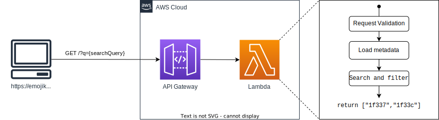

# 🧑‍🍳 Emoji Kitchen Backend

This repository holds both the Terraform infrastructure code as well as the simple Javascript application that runs inside the AWS Lambda function.

This application code is a basic API service that takes in a search query, finds the related emoji codepoints, and returns it to the frontend client.

The infrastructure supporting this backend application is a simple public API Gateway that forwards valid requests to the Lambda function.

This backend application is used to support the website [https://emojikitchen.dev](https://emojikitchen.dev) for quick and reliable search.

## Getting Started

This repository leverages [VSCode's devcontainer](https://code.visualstudio.com/docs/remote/containers) feature to ensure all necessary dependencies are available inside the container for development.

### Application

The application code for this repository is contained in the [`./app`](./app) directory.

To get started:

```bash
cd app/ && npm install
```

All application deployments are managed via GitHub Actions and the [`./.github/workflows/deploy_application.yml`](./.github/workflows/deploy_application.yml) workflow.

### Infrastructure

The infrastructure code for this repository is contained in the [`./terraform`](./terraform) directory. The required Terraform version is `1.10.2`. The AWS artifacts managed in this repository are illustrated below.

To get started:

```bash
cd terraform/ && terraform init
```

All infrastructure deployments are managed via GitHub Actions and the [`./.github/workflows/deploy_infrastructure.yml`](./.github/workflows/deploy_infrastructure.yml) workflow.


